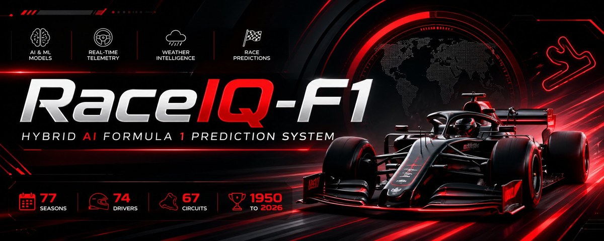

<p align="center">
  
</p>

<p align="center">
  
  
  
  
  
</p>

# RaceIQ-F1 — Hybrid AI Formula 1 Prediction System

> **XGBoost × LSTM × Weather Intelligence**
> Race prediction across 77 seasons, 67 real circuits, and 74 drivers — 1950 to 2026.

---

## 📸 Banner not showing on GitHub?

> **If you see a broken image above**, you need to commit the `assets/` folder.
> After cloning / downloading the zip, run:
> ```bash
> git add assets/banner.jpg
> git commit -m "add banner"
> git push
> ```
> The image path `assets/banner.jpg` is correct — GitHub just needs the file committed.

---

## ⚡ Quickest Start (one command)

```bash
# Mac / Linux
chmod +x run.sh && ./run.sh

# Windows (Command Prompt or double-click)
run.bat
```

This script handles **everything**: Python version check, OpenMP fix (Mac), virtual environment, install, training, and Streamlit launch.

---

## 🖥️ Manual Setup

### Prerequisites

| Requirement | Version | Notes |
|------------|---------|-------|
| Python | **3.9 – 3.13** | ⚠️ Python 3.14 NOT supported — XGBoost upstream incompatibility |
| Homebrew | any | Mac only — needed for `libomp` |

---

### Step 1 — Fix OpenMP on Mac

XGBoost requires the OpenMP runtime on macOS. Without it you get:
```
XGBoostError: Library not loaded: @rpath/libomp.dylib
```
**Fix:**
```bash
brew install libomp
```
If Homebrew is not installed:
```bash
/bin/bash -c "$(curl -fsSL https://raw.githubusercontent.com/Homebrew/install/HEAD/install.sh)"
brew install libomp
```

---

### Step 2 — Use Python 3.9–3.13

```bash
python3 --version   # check current version
```

If you have Python 3.14 (breaks XGBoost):
```bash
brew install python@3.12          # Mac
sudo apt install python3.12       # Ubuntu/Debian
```

---

### Step 3 — Create a virtual environment

```bash
# Mac / Linux
python3.12 -m venv .venv
source .venv/bin/activate

# Windows Command Prompt
python -m venv .venv
.venv\Scripts\activate.bat

# Windows PowerShell
python -m venv .venv
.venv\Scripts\Activate.ps1
```

You should see `(.venv)` in your prompt.

---

### Step 4 — Install the package

```bash
pip install -e .
```

`-e` (editable mode) makes `import data` and `import models` work correctly from any directory — this permanently fixes `ModuleNotFoundError: No module named 'models'`.

---

### Step 5 — Train the model

```bash
python train.py
```

Expected output:
```
[Data] Loading data/f1_1950_2026.csv…
[Data] 14,264 rows | 74 drivers | 67 circuits | 77 seasons
[1/4] Engineering features…
[3/4] Training XGBoost…
[XGBoost] Train MAE: 1.412
── Training Metrics ──────────────────────────
   mae_xgboost : 1.412
   mae_lstm    : 3.757
   mae_hybrid  : 2.190
✅  Training complete!
```

---

### Step 6 — Launch the dashboard

```bash
streamlit run app.py
# Open http://localhost:8501
```

---

## 🔮 CLI Predictions

```bash
# 2024 Monaco — dry
python predict.py --circuit monaco --year 2024

# 1988 Spa — heavy rain (Senna/Prost era)
python predict.py --circuit spa --year 1988 --rainfall 20 --track-temp 16

# 1967 Silverstone (Jim Clark era)
python predict.py --circuit silverstone --year 1967

# List all 67 circuits
python predict.py --list-circuits
```

---

## 📋 Command Reference

| Command | What it does |
|---------|-------------|
| `./run.sh` | Full setup + Streamlit (Mac/Linux) |
| `run.bat` | Full setup + Streamlit (Windows) |
| `python train.py` | Train / retrain the model |
| `python predict.py --circuit monaco --year 2024` | Predict a race |
| `python predict.py --list-circuits` | List all 67 circuits |
| `streamlit run app.py` | Launch dashboard |
| `python test_model.py` | Run 90-test suite |
| `python analysis.py` | Historical stats |

### train.py flags
```bash
python train.py --years 1990 2026           # subset of seasons
python train.py --regen                     # regenerate dataset
python train.py --cv                        # 5-fold cross-validation
python train.py --w-xgb 0.5 --w-lstm 0.3   # custom ensemble weights
```

### predict.py flags
```bash
python predict.py --circuit spa --year 2024 \
  --rainfall 15 --track-temp 18 --humidity 85 --wind 25 --top 10
```

---

## 🗂️ Project Structure

```
RaceIQ_F1/
│
├── assets/
│   └── banner.jpg              ← RaceIQ-F1 hero banner  ← COMMIT THIS FILE
│
├── app.py                      ← Streamlit dashboard (6 pages)
├── train.py                    ← Training entrypoint
├── predict.py                  ← CLI prediction tool
├── test_model.py               ← 90-test validation suite
├── analysis.py                 ← Historical stats
├── setup.py                    ← Package installer (fixes ModuleNotFoundError)
├── requirements.txt            ← pip requirements
├── run.sh                      ← One-shot Mac/Linux setup + launch
├── run.bat                     ← One-shot Windows setup + launch
│
├── data/
│   ├── f1_1950_2026.csv        ← 14,264 rows pre-generated
│   ├── generate_dataset.py     ← Dataset builder (67 circuits, 74 drivers)
│   └── features.py             ← Feature engineering pipeline
│
├── models/
│   ├── xgboost_model.py        ← XGBoost tabular predictor
│   ├── lstm_model.py           ← BiLSTM + EWM fallback
│   ├── hybrid_engine.py        ← Fusion engine
│   └── saved/
│       ├── xgboost_f1.pkl      ← Pre-trained weights (included)
│       └── pipeline.pkl        ← Feature pipeline state (included)
│
├── outputs/
│   ├── test_report.json
│   └── analysis.json
│
└── .streamlit/
    └── config.toml             ← Dark F1 theme
```

---

## 🔧 Troubleshooting

### Banner image not showing on GitHub
The image path is correct. You just need to commit the file:
```bash
git add assets/
git commit -m "add banner image"
git push
```

### `ModuleNotFoundError: No module named 'models'`
Run `pip install -e .` once, then always run from the project root:
```bash
cd /path/to/RaceIQ_F1
python train.py                                       # ✅ correct
python predict.py --circuit monaco --year 2024        # ✅ correct
python models/hybrid_engine.py                        # ❌ never run sub-modules directly
```

### `XGBoostError: Library not loaded: libomp.dylib` (Mac)
```bash
brew install libomp
```

### `zsh: segmentation fault python train.py` (Mac)
You are on Python 3.14. Install Python 3.12:
```bash
brew install python@3.12
python3.12 -m venv .venv
source .venv/bin/activate
pip install -e .
python train.py
```

### `streamlit: command not found`
```bash
source .venv/bin/activate
pip install streamlit
streamlit run app.py
```

### Skip training — use pre-trained model
`models/saved/` is already included. Go straight to predictions:
```bash
pip install -e .
python predict.py --circuit monaco --year 2024
streamlit run app.py
```

---

## 🧠 Model Architecture

```
┌──────────────────────────────────────────────────────────────┐
│         DATA LAYER  (1950 – 2026)                            │
│  14,264 entries · 67 circuits · 74 drivers · 28 teams        │
│  Era-accurate DNF rates · All real F1 points systems         │
└──────────────┬───────────────────────────────────────────────┘
               │  25 tabular features + 7 sequence features
┌──────────────▼──────────────┐   ┌───────────────────────────┐
│   XGBoost (50%)             │   │   LSTM / EWM (30%)         │
│   500 trees · depth 6       │   │   BiLSTM(64)→LSTM(32)     │
│   L1+L2 regularisation      │   │   Last 5 races per driver  │
│   MAE ≈ 1.4 positions       │   │   EWM fallback (no TF)     │
└──────────────┬──────────────┘   └──────────────┬────────────┘
               └──────────────┬───────────────────┘
                              │  + Weather penalty (20%)
                     ┌────────▼──────────┐
                     │  Hybrid Engine     │
                     │  softmin → Win %  │
                     │  MAE ≈ 2.2 pos    │
                     └───────────────────┘
```

### Weather features
| Feature | Formula | Range |
|---------|---------|-------|
| `rain_factor` | `rainfall > 0` | 0 / 1 |
| `grip_index` | `(1 - humidity/100) × (1 - rain)` | 0 – 1 |
| `wind_penalty` | `wind_speed / 60` capped | 0 – 1 |
| `temp_effect` | `track_temp / 50` | 0 – 1 |
| `weather_score` | `0.4×grip + 0.3×(1-wind) + 0.3×temp` | 0 – 1 |

---

## 🏁 Dashboard Pages

| Page | Description |
|------|-------------|
| 🏠 Home | All-time wins, constructor trends, DNF rate by decade |
| 🔮 Race Predictor | Any circuit/year/weather → podium + full grid + win % |
| 📊 Driver Analytics | Multi-driver wins, points, DNF rate, scatter plots |
| 🏆 Championships | 77 season champions, multi-title table, constructor titles |
| 🌧 Weather Lab | Dry vs wet probability comparison simulator |
| 🗺 Circuit Map | Interactive world map of all 67 venues |

---

<p align="center">
  
  <br/>
  <sub>Built with XGBoost · LSTM · Streamlit · Plotly &nbsp;|&nbsp; 1950 – 2026</sub>
</p>
